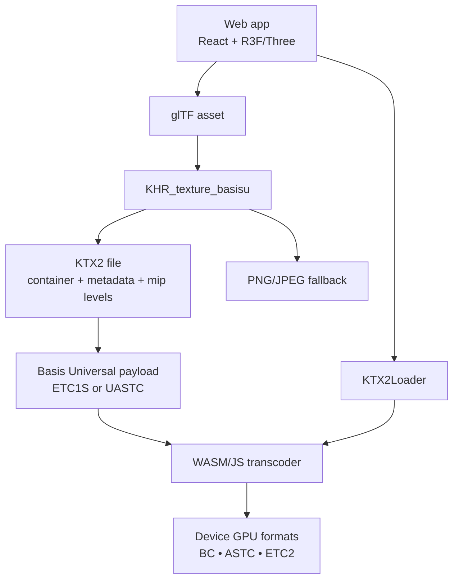

# KTX2 Textures for High‑Performance 3D Web Applications

## Executive summary

KTX2 is a GPU-texture container format designed to move texture work out of your critical rendering path: instead of decoding PNG/JPEG on the CPU and uploading large uncompressed images to the GPU, you ship textures in a universal, GPU-friendly form that can be *transcoded* at runtime into the best compressed format supported by the device. KTX 2.0 explicitly adds “universal textures using Basis Universal technology and supercompression” and supports texture streaming concepts via mip levels. [1]

In real-world glTF assets, the biggest win is usually **GPU memory** (and “upload jank”), not always total download size. Khronos’ own artist guide shows examples where file size changes modestly while GPU memory drops dramatically (e.g., a 512² PNG duck texture goes from ~1.5MB GPU memory to ~277KB with KTX; and a larger model drops from ~96MB to ~21MB GPU memory after KTX compression). [2]

For senior front-end / creative-dev workflows, the practical “KTX2 playbook” is:

- **Build-time**: convert texture assets (or glTF packages) to KTX2 using `toktx` / `gltf-transform`, choose ETC1S vs UASTC per map type, generate mipmaps, and retain JPEG/PNG fallbacks where appropriate via `KHR_texture_basisu`. [3] [6] [10]  
- **Runtime**: configure `KTX2Loader` once (singleton), call `detectSupport(renderer)`, set worker limits, and handle color-space correctly (`Texture.colorSpace`). [4] [15]  
- **Design**: reserve procedural textures for what must be dynamic (data, audio-reactive, interaction), and keep heavy “micro-detail” in KTX2 so the GPU budget stays stable under animation and navigation.

## What KTX2 is and why it exists

KTX 2.x (Khronos Texture) is specified as a lightweight, GPU-oriented container that can carry everything from a base 2D texture to cubemap arrays with mipmaps, and it “holds all the parameters needed for efficient texture loading” into APIs like OpenGL and Vulkan; the spec explicitly lists WebGL among its target GPU APIs. [1]

The key KTX2 idea for the web is **universality without shipping N variants**:

- The **`KHR_texture_basisu`** glTF extension defines how to store a `.ktx2` image as an alternative to PNG/JPEG, optionally keeping PNG as a fallback for clients that don’t support the extension. [6]  
- At runtime, engines “are expected to transcode” the universal payload into whatever block-compressed GPU format is available. [6] [4]  
- In Three.js, `KTX2Loader` “transcodes to a supported GPU compressed texture format” and depends on a WASM transcoder (Basis) shipped with the Three.js examples. [4] [12]

This shifts the work from “CPU decode + big upload” toward “fast transcode + small upload,” and it allows your asset pipeline to target a broad hardware set without hand-authoring ASTC/ETC/BC triples.

## Technical benefits and measurable impact

### Download size and transmission

KTX2 *can* reduce download size, but it’s not guaranteed to always beat JPEG/WebP under every content profile; the Khronos artist guide explicitly frames KTX as best when **loading time and memory conservation** are priorities, while formats like WebP/JPEG may win on smallest file size for single-model use cases. [2]

A concrete, credible metric example from a WebGPU best-practices deck shows asset size reductions when applying texture compression via `gltf-transform etc1s`: `paddle.glb` drops from ~11.92MB to ~1.73MB, and further pipeline steps reduce it to ~596KB. [9]

### GPU-native formats and VRAM savings (often the biggest win)

The KTX artist guide provides two illustrative VRAM deltas:

- **Duck (512×512 PNG)**: file size changes minimally (~118KB → ~116KB), but GPU memory drops heavily (~1.5MB → ~277KB), ~82% less GPU memory. [2]  
- **StainedGlassLamp**: overall file size drops (~13MB → ~10MB), while GPU memory drops (~96MB → ~21MB), i.e. GPU footprint becomes roughly one-fifth. [2]

Why this happens is structural: PNG/JPEG/WebP are *decoded* and uploaded as uncompressed GPU textures, whereas GPU block-compressed formats remain compressed in GPU memory. Khronos’ guide calls this out as a distinguishing advantage of KTX in glTF pipelines. [2] [6]

A useful “rule-of-thumb math lens” for artists and performance engineers is to compare **bits per pixel**:

- Uncompressed RGBA8: 32 bpp (4 bytes/pixel)  
- BC1/DXT1: 4 bpp  
- BC7/DXT5-class: 8 bpp  

Unity’s importer documentation summarizes these bpp values for common desktop formats (DXT1 at 4 bpp, BC7 at 8 bpp). That implies (very roughly) **8×** VRAM reduction vs RGBA8 for 4 bpp formats, and **4×** reduction for 8 bpp formats, before accounting for mip chains. [11]

### Supercompression, Basis (ETC1S vs UASTC), and transcoding

The glTF extension spec allows two Basis Universal modes inside KTX2: **ETC1S with BasisLZ** and **UASTC with optional Zstandard**, and it specifies constraints like mip availability and color-space metadata. [6]

Basis Universal guidance presents an engineer-friendly mental model:

- **ETC1S**: very small files, lower/medium quality; designed for fast transcoding; the docs even compare transcoding speed favorably vs JPEG decode in some cases. [12]  
- **UASTC**: higher quality, intended to approach high-quality GPU formats; often preferred for normal maps and channel-packed textures to avoid cross-channel artifacts. [2] [12]

### Mipmaps, metadata, and color fidelity

KTX2 supports complete mip chains (and the KTX spec discusses streaming concepts “through sending small mip levels first”). [5]  
The `KHR_texture_basisu` spec recommends including a full mip pyramid when the sampler uses mipmap minification; otherwise engines may need to decompress and regenerate missing mips at runtime. [7]

Metadata matters in real pipelines:

- `toktx` writes orientation metadata by default (`KTXorientation`), and the glTF extension restricts orientation values to remain compatible (“rd” or omitted). [3] [6]  
- The glTF extension also requires color-space information: sRGB transfer for color textures, linear transfer for non-color data like normal maps. [6]  
- In modern Three.js, `Texture.encoding` has been replaced by `Texture.colorSpace`, and docs explicitly state color textures should use `SRGBColorSpace` (or `LinearSRGBColorSpace` as appropriate). [15]

## Integration patterns in React + Three.js/R3F + Motion

This section assumes modern React (19.x) and contemporaneous Drei/R3F ecosystems; React’s official versions page confirms the current major line and patch cadence. [17]

### Runtime loading: KTX2Loader done right

In Three.js, `KTX2Loader` requires:

1) `setTranscoderPath(...)` to your Basis WASM assets  
2) `detectSupport(renderer)` before any load  
3) optional worker tuning (`setWorkerLimit`)  
4) cleanup via `.dispose()` when done [8]

> **Code in this lesson:** **CodeSandbox-ready** blocks are complete React mini-apps or copy-paste units where noted. **Excerpt** blocks are partial—loader setup, shell fragments, or snippets you embed in your own scene and render loop.

**Plain Three.js example (async/await, safe defaults):**

*Excerpt — configure `KTX2Loader` and a material; wire `material` to a mesh, scene, camera, and animation loop in your host app. Serve Basis transcoder assets at `/basis/`.*

```js
import * as THREE from "three";
import { KTX2Loader } from "three/addons/loaders/KTX2Loader.js";

const renderer = new THREE.WebGLRenderer({ antialias: true });

const ktx2 = new KTX2Loader()
  .setTranscoderPath("/basis/")      // contains basis_transcoder.js/.wasm
  .detectSupport(renderer)
  .setWorkerLimit(2);

const albedo = await ktx2.loadAsync("/textures/albedo.ktx2");
albedo.colorSpace = THREE.SRGBColorSpace;  // color data

const material = new THREE.MeshStandardMaterial({ map: albedo });
```

**WebGPU note:** Three.js’ migration guide indicates `detectSupportAsync()` is deprecated; `detectSupport()` should be used after the renderer has been initialized (e.g., `await renderer.init()` for WebGPU). [19] [4]

### React Three Fiber + Drei: avoiding “multiple active KTX2 loaders”

In React Three Fiber, Drei provides convenience hooks and `extendLoader` for special loader wiring:

- `useKTX2()` is a convenience wrapper around `useLoader` + `KTX2Loader`. [21]  
- `useGLTF(..., extendLoader)` allows you to attach a KTX2 loader to the internal `GLTFLoader` (example shown in Drei docs). [22]

However, long-running, asset-heavy experiences should **centralize KTX2Loader**. Community issues document warnings and memory/perf concerns if multiple loader instances spawn multiple transcode workers (“Multiple active KTX2 loaders…”). [23] [4]

**Recommended pattern: singleton KTX2Loader + extendLoader**

*CodeSandbox-ready — single-file `App.jsx`; split `getKTX2Loader` into `ktx2Singleton.js` in real projects. Serve Basis files at `/basis/` (copy from `three/examples/jsm/libs/basis/` into `public/basis/`). Replace `/model.glb` with a glTF that uses `KHR_texture_basisu` or keep PNG fallbacks.*

```jsx
import { Suspense } from 'react'
import { Canvas, useThree } from '@react-three/fiber'
import { useGLTF, OrbitControls } from '@react-three/drei'
import { KTX2Loader } from 'three/addons/loaders/KTX2Loader.js'

let ktx2Singleton = null

export function getKTX2Loader(gl) {
  if (!ktx2Singleton) {
    ktx2Singleton = new KTX2Loader()
      .setTranscoderPath('/basis/')
      .detectSupport(gl)
      .setWorkerLimit(2)
  }
  return ktx2Singleton
}

function Model() {
  const { gl } = useThree()
  const gltf = useGLTF('/model.glb', true, true, (loader) => {
    loader.setKTX2Loader(getKTX2Loader(gl))
  })
  return <primitive object={gltf.scene} />
}

export default function App() {
  return (
    <div style={{ width: '100%', height: '100vh' }}>
      <Canvas camera={{ position: [2, 2, 5] }}>
        <color attach="background" args={['#0f172a']} />
        <ambientLight intensity={0.55} />
        <directionalLight position={[4, 6, 3]} intensity={1.1} />
        <Suspense fallback={null}>
          <Model />
        </Suspense>
        <OrbitControls makeDefault />
      </Canvas>
    </div>
  )
}
```

This aligns with Drei’s documented `extendLoader` hook signature and avoids scaling worker pools with scene complexity. [22] [23] [4]

### sRGB/linear handling in Three.js scenes (color-managed pipelines)

Minimal, reliable guidance:

- **BaseColor / Emissive**: `texture.colorSpace = SRGBColorSpace`  
- **Normal / Roughness / Metalness / AO / Data maps**: keep linear (default is typically “no color space” unless set by loaders)  
- If you are authoring KTX2 for glTF, `KHR_texture_basisu` requires that the KTX DFD transfer function match expected usage (sRGB for color, linear for non-color). [6] [15]

### Fallback strategies for unsupported devices/browsers

You have three practical fallback layers:

1) **glTF-level fallback** (best): Keep PNG/JPEG as `textures[i].source` and add KTX2 via `KHR_texture_basisu`. Clients without the extension load PNG. [18]  
2) **Runtime loader fallback**: if KTX2 transcoder assets fail to load, or WASM isn’t supported, catch errors and load PNG/WebP. Three.js docs explicitly note the loader relies on WebAssembly and won’t work in older browsers. [4]  
3) **Content strategy**: for tiny UI textures or single-model “hero” with strict download budgets, consider leaving some assets as WebP/JPEG and reserving KTX2 for heavy VRAM offenders (HDRI/specular chains, repeated tilers, high-res lightmaps). Khronos’ guide explicitly frames this trade. [10]  

### Motion (Framer Motion → motion/react) integration: driving shaders and camera without re-render storms

Motion documents Motion Values as signal-like values designed for high-frequency updates without React re-rendering, and the upgrade guide confirms the modern import path `motion/react`. [28]

A proven pattern (Codrops) is: create a MotionValue, animate it, pass it into an R3F component, and *read it inside `useFrame()`* to update uniforms each frame. [20]

**Example: Motion-driven reveal shader + KTX2 texture**

*CodeSandbox-ready — `motion/react` + R3F; uses a tiny `DataTexture` as `uMap` so the shader runs without a `.ktx2` file. For real KTX2, load with your singleton `KTX2Loader` (above) and assign `uniforms.uMap.value` once the texture resolves.*

```jsx
import { useMemo, useRef } from 'react'
import { Canvas, useFrame } from '@react-three/fiber'
import * as THREE from 'three'
import { animate, useMotionValue } from 'motion/react'

const vert = `
  varying vec2 vUv;
  void main() {
    vUv = uv;
    gl_Position = projectionMatrix * modelViewMatrix * vec4(position, 1.0);
  }
`

const frag = `
  uniform float uTime;
  uniform float uProgress;
  uniform sampler2D uMap;
  varying vec2 vUv;

  void main() {
    vec3 c = texture2D(uMap, vUv).rgb;
    float r = distance(vUv, vec2(0.5));
    float mask = smoothstep(uProgress, uProgress - 0.15, r);
    gl_FragColor = vec4(c, mask);
  }
`

function RevealPlane({ progress }) {
  const matRef = useRef()

  const uniforms = useMemo(() => {
    const data = new Uint8Array([120, 180, 255, 255])
    const tex = new THREE.DataTexture(data, 1, 1, THREE.RGBAFormat)
    tex.needsUpdate = true
    tex.colorSpace = THREE.SRGBColorSpace
    return {
      uTime: { value: 0 },
      uProgress: { value: 0 },
      uMap: { value: tex },
    }
  }, [])

  useFrame(({ clock }) => {
    const m = matRef.current
    if (!m) return
    m.uniforms.uTime.value = clock.elapsedTime
    m.uniforms.uProgress.value = progress.get()
  })

  return (
    <mesh>
      <planeGeometry args={[1, 1, 64, 64]} />
      <shaderMaterial
        ref={matRef}
        transparent
        uniforms={uniforms}
        vertexShader={vert}
        fragmentShader={frag}
      />
    </mesh>
  )
}

export default function App() {
  const progress = useMotionValue(0)

  const toggle = () => {
    animate(progress, progress.get() > 0.5 ? 0 : 1, { duration: 1.2, ease: 'easeInOut' })
  }

  return (
    <>
      <button type="button" onClick={toggle}>
        Toggle reveal
      </button>
      <div style={{ width: '100%', height: '70vh' }}>
        <Canvas camera={{ position: [0, 0, 1.6] }}>
          <RevealPlane progress={progress} />
        </Canvas>
      </div>
    </>
  )
}
```

This is the same architectural idea as the Codrops example: MotionValue updates in the render loop, not in React state. [20] [28]

## Procedural & mathematical texture generation

KTX2 is an *asset container*; procedural generation is about how you **author** pixels (or volumes) that you later compress (build-time) or keep dynamic (runtime). The best workflows treat procedural textures as “first-class data products,” with explicit mappings into channels and color spaces.

### Core mappings: turning math into texture channels

Think in terms of **channels as semantic fields**:

- **R**: scalar field (height, density, distance, threshold)  
- **G**: secondary scalar (gradient magnitude, roughness, data dimension #2)  
- **B**: tertiary (curvature, ambient term, data dimension #3)  
- **A**: mask / confidence / ID / temporal accumulation

For physically-based pipelines, avoid packing radically unrelated channels into ETC1S unless the texture is low-frequency; Khronos explicitly notes that “packed” textures (ORM, normal) often compress better with UASTC. [2]

### Noise (Perlin / gradient noise)

Perlin’s “Improving Noise” paper is the modern canonical reference for gradient-noise improvements. [31]

A practical, shader-friendly formulation:

- Lattice gradients \(g_{ij}\) at grid points  
- Dot with local offset \(d = (x-i, y-j)\)  
- Interpolate with a smooth “fade” function \(f(t)\)  

A common fade is:
\[
f(t) = 6t^5 - 15t^4 + 10t^3
\]

Noise value (2D conceptual):
\[
n(x,y)=\text{lerp}_y\left(\text{lerp}_x(g_{00}\cdot d_{00},\, g_{10}\cdot d_{10}),\ \text{lerp}_x(g_{01}\cdot d_{01},\, g_{11}\cdot d_{11})\right)
\]

**Mapping tips**
- Use noise as **roughness** (linear): \(R = \text{clamp}(0.2 + 0.6n,0,1)\)  
- Use noise as **normal perturbation** by differentiating height \(h(x,y)\):  
\[
\mathbf{N} = \text{normalize}\left(
\begin{bmatrix}
-\partial h/\partial x\\
-\partial h/\partial y\\
1
\end{bmatrix}
\right)
\]
Store normals in RGB as \((N_x,N_y,N_z)\) remapped to \([0,1]\).

### Fractals (Mandelbrot / Julia) for rich, art-directable fields

For Mandelbrot iteration:
\[
z_{0}=0,\ \ z_{n+1}=z_n^2 + c
\]
Escape time:
\[
E(c)=\min\{n:\ |z_n|>2\}
\]

**Mapping tips**
- Store normalized escape time in **R**  
- Store “smooth escape” (continuous coloring) in **G**:
\[
E_s = n + 1 - \log_2(\log|z_n|)
\]
- Use **A** as a mask for interior points (never escaped).

These textures are ideal candidates for:
- emissive masks  
- transition mattes  
- data backplates for “award-level” UI reveal effects

### Voronoi / Worley noise (cellular textures)

Worley’s “A Cellular Texture Basis Function” defines noise via distances to nearest feature points. [32]

Let \(F_k(x)\) be the distance from \(x\) to the \(k\)-th nearest seed. Common fields:
- “Cells”: \(F_1\) (distance to nearest)  
- “Borders”: \(F_2 - F_1\)

**Mapping tips**
- **R** = \(F_1\) (soft blobs)  
- **G** = \(F_2 - F_1\) (cracks, ridges)  
- **B** = hashed cell ID (for palette indexing)  
- **A** = border mask via `smoothstep`

### Delaunay triangulation and duality with Voronoi (for structured “data skins”)

Delaunay triangulation is the dual graph of the Voronoi diagram; it’s the backbone of “network meshes” and triangulated heatmaps in data-representation art. [16] [33]

A Delaunay condition: for triangles, no point lies inside any triangle’s circumcircle. In 2D, circumcircle tests can be expressed via a determinant predicate (widely used in robust computational geometry). [33]

**Mapping tips**
- Build a 2D point set from data (e.g., Poisson disk sampling weighted by density)  
- Delaunay edges → render into a texture as line distance field (SDF)  
- Use distance-to-edge as roughness modulation or alpha mask.

### Spherical harmonics (SH): compact encodings for lighting-like fields

Spherical harmonics are widely used to approximate smooth directional signals (irradiance, visibility). GPU Gems includes practical SH evaluation guidance for real-time pipelines. [35]  
Robin Green’s “Spherical Harmonic Lighting: The Gritty Details” is a canonical deep dive. [36]

SH projection:
\[
f(\omega) \approx \sum_{l=0}^{L}\sum_{m=-l}^{l} c_{lm}\,Y_l^m(\omega)
\]

**Mapping tips**
- Store low-order SH coefficients (e.g., 9 coefficients for \(L=2\)) in a texture atlas (RGB coefficients per texel)  
- Use in shaders for view-dependent lighting accents tied to data directionality.

### Oscillators and wavefields (motion-first textures)

For a 2D wave interference field:
\[
u(x,y,t)=\sum_i A_i \sin(\mathbf{k}_i\cdot(x,y)-\omega_i t+\phi_i)
\]
Map:
- **R** = normalized amplitude  
- **G/B** = gradient (for anisotropic shading)  
- **A** = thresholded crest mask for foam/glow

These are excellent for “living surfaces” when combined with Motion-driven uniforms and scroll/gesture coupling.

## Pipelines, conversion settings, and performance best practices

### Pipeline flow (Mermaid)

```mermaid
flowchart LR
  A[Authoring sources\nPNG/TIFF/EXR • procedural fields • baked maps] --> B[Preprocess\nresize • channel packing • color tags • mip policy]
  B --> C[Encode to KTX2\n(toktx / ktxsc / basisu)\nETC1S or UASTC + zstd]
  C --> D[Package\nGLB/GLTF + KHR_texture_basisu\n(optional PNG fallback)]
  D --> E[Runtime load\nKTX2Loader + WASM transcoder]
  E --> F[Transcode\nselect BC/ASTC/ETC2\nbased on device]
  F --> G[GPU upload\ncompressed in VRAM]
  G --> H[Render\nPBR + shaders + motion]
```

KTX 2.0’s spec and glTF extension explicitly support this “universal → transcode” model, with mipmaps and fallback semantics handled at the asset level. [37] [41] [38]

### Entity relationships (Mermaid)



This is directly consistent with how Three.js documents `KTX2Loader` behavior and how the glTF `KHR_texture_basisu` extension defines fallback and runtime expectations. [44] [43]

### Example pipelines: in-browser, build-time, Python

**In-browser shader generation (WebGL/WebGPU)**
- Render procedural patterns into a `WebGLRenderTarget` / `GPUTexture`, then reuse that texture directly for shading.
- Best when textures must respond to data/interaction/audio in real time (you *can’t* precompress everything).
- For WebGPU, MDN and the WebGPU spec expose compressed texture support as feature flags (`texture-compression-*`), but runtime generation typically produces uncompressed textures unless you implement a compressor. [39]

**Build-time conversion (recommended default)**
- Convert image assets → `.ktx2` using Khronos tools (`toktx`, `ktxsc`) and/or convert full glTFs with `gltf-transform etc1s/uastc`.
- Khronos’ guide provides concrete compression settings and shows why mipmaps and correct transfer functions matter. [40] [14] [42]

**Python generator (parallel authoring pipeline)**
- Generate textures as NumPy arrays (noise fields, triangulation visualizations, fractal escape-time maps), then save to PNG/EXR and compress with `toktx`.
- Best when your procedural generation uses scientific tooling (NumPy/SciPy), deterministic builds, or offline heavy compute.

### Decision matrix: choosing where to generate textures

| Criterion | In-browser (GPU shader / runtime) | Build-time (toktx / gltf-transform) | Python generator (offline) |
|---|---|---|---|
| First-visit latency | Often best *if* no heavy downloads; worst if you must generate large maps on client | Usually best overall (fast decode/transcode + caching) | Similar to build-time if you ship outputs; generation cost moved to CI |
| Visual determinism | Can vary by GPU precision / browser | High (CI-controlled) | Very high (seeded, reproducible) |
| Download size | Potentially minimal | Often reduced; not always smallest vs WebP/JPEG | Depends on build-time compression of outputs |
| GPU memory footprint | Depends (often uncompressed) | Strong (compressed stays in VRAM) | Strong (if you compress outputs) |
| Control / art direction | Highest for interactive & data-driven | High but “baked” | Highest for data workflows & custom fields |
| Scaling across many assets | Hard (runtime cost scales with content) | Excellent | Good (CI time scales, not user time) |
| Dev complexity | Medium–high | Medium | Medium–high (tooling + packaging) |
| Best use cases | Audio-reactive, interactive data skins, simulations | Product configurators, portfolio scenes, multi-asset worlds | Data visualization textures, scientific pipelines, bespoke atlases |

This lines up with Khronos guidance: KTX is most valuable when memory and smoothness matter, while other formats may win purely on file size for simpler scenarios. [49]

### Asset settings: practical `toktx` recipes by map type

Below are pragmatic starting points. Tune quality with visual inspection (especially for normals and packed maps).

*Excerpt — CLI recipes; run in your terminal with [KTX-Software](https://github.com/KhronosGroup/KTX-Software) installed.*

**BaseColor / Emissive (color data → sRGB)**
```bash
toktx --t2 --encode etc1s --clevel 4 --qlevel 255 --genmipmap basecolor.ktx2 basecolor.png
```
ETC1S is typically recommended for color textures in the glTF extension guidance, with full mips when using mipmap sampling. [6] [10] [3]

**Normal / ORM packed maps (non-color → linear, prefer UASTC)**
```bash
toktx --t2 --encode uastc --uastc_quality 4 --zcmp 18 --genmipmap \
  --assign_oetf linear --assign_primaries none \
  normal.ktx2 normal.png
```
Khronos’ artist guide strongly suggests UASTC for packed/normal textures, and the glTF extension requires linear transfer for non-color data. [13] [25]

**High-quality UASTC with RDO (slower encode, smaller on disk)**
```bash
# ktxsc is useful when you want more explicit RDO control for UASTC conditioning
ktxsc --uastc --uastc_rdo_q 2.0 --zstd 18 input.png -o output.ktx2
```
Khronos tooling notes that UASTC data can be conditioned for Zstandard using RDO-related options for better results. [42]

**Constraints to respect**
- `KHR_texture_basisu` requires pixel width/height be multiples of 4, and recommends power-of-two for compatibility; also consider aligning UV seams to reduce block artifacts. [6] [2]  
- Generate mipmaps during compression (`--genmipmap`) because compressed textures are not cheap to mip at runtime, and missing mips can force runtime workarounds. [3] [7] [13]

### Web performance best practices that matter in production

- **Use one KTX2Loader instance per renderer**; tune workers with `setWorkerLimit` and call `.dispose()` when it’s truly no longer needed (route-based apps can leak workers otherwise). [44] [23]  
- **Prefer mipmapped KTX2** for anything that minifies; glTF extension guidance says a full mip pyramid “should” be present under common sampling conditions. [18] [14]  
- **Budget VRAM explicitly**: compressed textures reduce VRAM and upload bandwidth; this is often the difference between smooth transitions and “one-frame stalls” when entering a scene. [49] [45]  
- **Pick ETC1S vs UASTC by *content*, not ideology**: ETC1S excels on large smooth areas; UASTC is safer for high-frequency detail and channel-packed maps. [50] [12]  
- **Color management is not optional** in modern Three.js: set `Texture.colorSpace` correctly for any manually loaded textures. [15]  
- **WebGPU readiness**: WebGPU exposes compressed texture families as feature flags (`texture-compression-bc`, `-etc2`, `-astc`). A “universal” supercompressed source (Basis/KTX2) avoids shipping multiple format variants, which is explicitly recommended in WebGPU best-practices materials. [46] [39]  

## Tooling, libraries, and primary sources to prioritize

### Primary/official sources (bookmark these)

*Excerpt — link list for bookmarks, not executable code.*

```text
KTX 2.0 Specification (Khronos): https://github.khronos.org/KTX-Specification/ktxspec.v2.html
KTX-Software tools + docs (toktx, ktxsc): https://github.com/KhronosGroup/KTX-Software
toktx reference: https://github.khronos.org/KTX-Software/ktxtools/toktx.html
ktxsc reference: https://github.khronos.org/KTX-Software/ktxtools/ktxsc.html
glTF KHR_texture_basisu spec (raw): https://raw.githubusercontent.com/KhronosGroup/glTF/main/extensions/2.0/Khronos/KHR_texture_basisu/README.md
Three.js KTX2Loader docs: https://threejs.org/docs/pages/KTX2Loader.html
Khronos KTX Artist Guide (raw): https://raw.githubusercontent.com/KhronosGroup/3D-Formats-Guidelines/main/KTXArtistGuide.md
Basis Universal docs: https://binomialllc.github.io/basis_universal/
WebGPU spec (W3C): https://www.w3.org/TR/webgpu/
MDN WebGPU supported features: https://developer.mozilla.org/en-US/docs/Web/API/GPUSupportedFeatures
```

The glTF extension spec is especially valuable because it encodes practical constraints (fallback semantics, mip expectations, transfer functions, dimension multiples of 4) that directly affect web robustness. [41]

### High-leverage libraries for “math → texture” workflows

- GLSL noise building blocks: `glsl-noise`-style Perlin/simplex implementations, and/or custom gradient noise following Perlin’s improved formulation. [31]  
- Python: NumPy (+ SciPy where needed) for deterministic field generation; then compress outputs with Khronos tools.
- For triangulation-heavy data skins, use a robust computational geometry source (e.g., de Berg et al.) as a reference baseline; Delaunay/Voronoi duality is central to stable mesh aesthetics. [34] [33]  
- SH lighting/fields: GPU Gems and Robin Green’s SH notes are pragmatic, production-tested references. [47] [36]

## Innovative project ideas and next steps

**Data Cathedral**
- Use Delaunay triangulation on a live dataset (e.g., per-city metrics), render edges into a distance-field texture atlas, compress to KTX2 (UASTC), and drive emissive intensity with scroll velocity (MotionValue → uniforms).  
- Add SH-encoded “directional meaning” (e.g., vector field) to modulate lighting response.

**Mirrorbox UI (hybrid DOM/3D)**
- Build a 3D product/data cube with KTX2-compressed micro-surface detail, but keep UI copy and controls in DOM overlays.  
- Use hybrid hit-testing: pointer hits in 3D trigger DOM transitions; DOM gestures modulate shader parameters.  
- Keep the visual richness in KTX2 while interactions remain web-native and accessible.

**Audio-reactive volumetrics**
- Generate a low-res 3D noise volume (runtime) for motion, but store high-frequency detail in KTX2 (build-time) as tiled 2D slices or precomputed flow maps.  
- In WebGPU, gate advanced compressed formats behind `adapter.features` (BC/ASTC/ETC2) while still shipping one universal source (Basis/KTX2 strategy). [39] [46]  

**Procedural brand system**
- Author a “mathematical brand texture” library: fractal fields for masks, Voronoi borders for separators, oscillator interference for gradients.  
- Precompress stable assets to KTX2; keep a small runtime generator for “live” accents tied to data or user motion.

**Immediate next steps**
1) Pick a representative hero scene and run a controlled A/B: PNG/WebP vs KTX2 (ETC1S for color, UASTC for normals/packed) including mipmaps; measure GPU memory and route-transition jank. [49] [38]  
2) Standardize a single KTX2Loader instance and wire it through R3F’s `extendLoader` for all glTF loads. [27] [23] [44]  
3) Define a “texture channel contract” for data representation (what R/G/B/A mean across your system) and enforce correct transfer functions (sRGB vs linear) at build time. [45] [15]

---

## Footnotes

[1]: https://github.khronos.org/KTX-Specification/ktxspec.v2.html
[2]: https://raw.githubusercontent.com/KhronosGroup/3D-Formats-Guidelines/main/KTXArtistGuide.md
[3]: https://github.khronos.org/KTX-Software/ktxtools/toktx.html
[4]: https://threejs.org/docs/pages/KTX2Loader.html
[5]: https://github.khronos.org/KTX-Specification/ktxspec.v2.html
[6]: https://raw.githubusercontent.com/KhronosGroup/glTF/main/extensions/2.0/Khronos/KHR_texture_basisu/README.md
[7]: https://raw.githubusercontent.com/KhronosGroup/glTF/main/extensions/2.0/Khronos/KHR_texture_basisu/README.md
[8]: https://threejs.org/docs/pages/KTX2Loader.html
[9]: https://www.khronos.org/developers/linkto/webgpu-best-practices
[10]: https://raw.githubusercontent.com/KhronosGroup/3D-Formats-Guidelines/main/KTXArtistGuide.md
[11]: https://docs.unity3d.com/es/2020.2/Manual/class-TextureImporterOverride.html
[12]: https://binomialllc.github.io/basis_universal/
[13]: https://raw.githubusercontent.com/KhronosGroup/3D-Formats-Guidelines/main/KTXArtistGuide.md
[14]: https://github.khronos.org/KTX-Software/ktxtools/toktx.html
[15]: https://threejs.org/docs/
[16]: https://en.wikipedia.org/wiki/Delaunay_triangulation
[17]: https://react.dev/versions
[18]: https://raw.githubusercontent.com/KhronosGroup/glTF/main/extensions/2.0/Khronos/KHR_texture_basisu/README.md
[19]: https://github.com/mrdoob/three.js/wiki/Migration-Guide
[20]: https://tympanus.net/codrops/2024/12/02/how-to-code-a-shader-based-reveal-effect-with-react-three-fiber-glsl/
[21]: https://raw.githubusercontent.com/pmndrs/drei/master/docs/loaders/ktx2-use-ktx2.mdx
[22]: https://raw.githubusercontent.com/pmndrs/drei/master/docs/loaders/gltf-use-gltf.mdx
[23]: https://github.com/pmndrs/drei/issues/2639
[24]: https://raw.githubusercontent.com/pmndrs/drei/master/docs/loaders/gltf-use-gltf.mdx
[25]: https://raw.githubusercontent.com/KhronosGroup/glTF/main/extensions/2.0/Khronos/KHR_texture_basisu/README.md
[26]: https://threejs.org/docs/pages/KTX2Loader.html
[27]: https://raw.githubusercontent.com/pmndrs/drei/master/docs/loaders/gltf-use-gltf.mdx
[28]: https://motion.dev/docs/react-motion-value
[29]: https://tympanus.net/codrops/2024/12/02/how-to-code-a-shader-based-reveal-effect-with-react-three-fiber-glsl/
[30]: https://tympanus.net/codrops/2024/12/02/how-to-code-a-shader-based-reveal-effect-with-react-three-fiber-glsl/
[31]: https://opengl.org.ru/ext/mrl.cs.nyu.edu/perlin/paper445.pdf
[32]: https://cedric.cnam.fr/~cubaud/PROCEDURAL/worley.pdf
[33]: https://cimec.org.ar/foswiki/pub/Main/Cimec/GeometriaComputacional/DeBerg_-_Computational_Geometry_-_Algorithms_and_Applications_2e.pdf
[34]: https://en.wikipedia.org/wiki/Delaunay_triangulation
[35]: https://developer.nvidia.com/gpugems/gpugems2/part-ii-shading-lighting-and-shadows/chapter-10-real-time-computation-dynamic
[36]: https://3dvar.com/Green2003Spherical.pdf
[37]: https://github.khronos.org/KTX-Specification/ktxspec.v2.html
[38]: https://threejs.org/docs/pages/KTX2Loader.html
[39]: https://developer.mozilla.org/en-US/docs/Web/API/GPUSupportedFeatures
[40]: https://raw.githubusercontent.com/KhronosGroup/3D-Formats-Guidelines/main/KTXArtistGuide.md
[41]: https://raw.githubusercontent.com/KhronosGroup/glTF/main/extensions/2.0/Khronos/KHR_texture_basisu/README.md
[42]: https://github.khronos.org/KTX-Software/ktxtools/ktxsc.html
[43]: https://raw.githubusercontent.com/KhronosGroup/glTF/main/extensions/2.0/Khronos/KHR_texture_basisu/README.md
[44]: https://threejs.org/docs/pages/KTX2Loader.html
[45]: https://raw.githubusercontent.com/KhronosGroup/glTF/main/extensions/2.0/Khronos/KHR_texture_basisu/README.md
[46]: https://www.khronos.org/developers/linkto/webgpu-best-practices
[47]: https://developer.nvidia.com/gpugems/gpugems2/part-ii-shading-lighting-and-shadows/chapter-10-real-time-computation-dynamic
[48]: https://developer.mozilla.org/en-US/docs/Web/API/GPUSupportedFeatures
[49]: https://raw.githubusercontent.com/KhronosGroup/3D-Formats-Guidelines/main/KTXArtistGuide.md
[50]: https://raw.githubusercontent.com/KhronosGroup/glTF/main/extensions/2.0/Khronos/KHR_texture_basisu/README.md