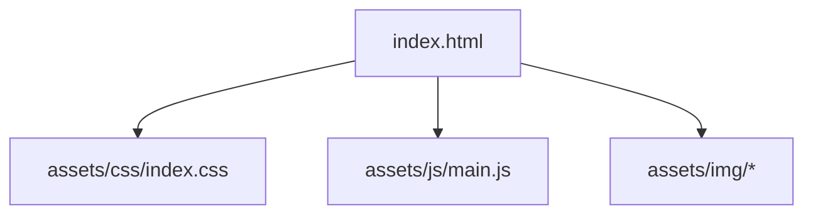

<!-- prettier-ignore-start -->

## 📋 Tabla de Contenidos
{: .no_toc }
- TOC
{:toc}

<!-- prettier-ignore-end -->

---

## Antes de empezar

| Requisito | ¿Obligatorio? |
| --- | --- |
| Sesión 1 completada (repo + URL GitHub Pages) | Sí |
| VS Code + Live Server operativos | Sí |
| `student-project-template` clonado en tu repo | Sí |
| Copilot / asistente IA | Opcional |

**Tiempo oficial:** 2 h de clase + 1 h de laboratorio.

---

## Sigue este camino

### Parte A — Git y flujo GitHub (obligatorio)

| Paso | Acción | Detalle |
| --- | --- | --- |
| A1 | Crear rama | `git checkout -b session-02-estructura-html` |
| A2 | Edición visible | Cambiar el texto del `<h1>` en `index.html` |
| A3 | Commit | `git commit -m "feat: improve index.html structure · session 2"` |
| A4 | Push de la rama | `git push -u origin session-02-estructura-html` |
| A5 | Abrir pull request | GitHub → Compare & pull request → describe el cambio |
| A6 | Fusionar (o pedir revisión) | Merge a `main`; borrar rama si la política lo permite |
| A7 | Sincronizar en local | `git checkout main && git pull` |

### Parte B — Estructura HTML en el template (obligatorio)

| Paso | Acción | Sección abajo |
| --- | --- | --- |
| B1 | Leer árbol del template y roles de archivos | Student Project Template |
| B2 | Añadir regiones semánticas en `<body>` | §4 El `<body>` y estructura semántica |
| B3 | Meta tags SEO en `<head>` | §3 Meta Tags para SEO |
| B4 | Enlazar CSS de entrada (`css/index.css` + reset) | §6 Estructura CSS |
| B5 | Previsualizar con Live Server; nuevo commit | Metodología ATELIER |

### Parte C — Enriquecimientos opcionales

Paquete favicon (§7) · apéndice Copilot · imágenes remotas ImageKit (§5.2) · medios locales (§5.1).

---

## Comprueba antes de salir

- [ ] Pull request fusionado (o aprobado) en GitHub
- [ ] La rama `main` muestra tus cambios HTML en Pages
- [ ] `<html lang="…">` correcto (usa `es` o `en` de forma coherente)
- [ ] Landmarks semánticos: `header`, `main`, `footer` (y `nav` si aplica)
- [ ] `project-brief.md` actualizado con una línea de reflexión ATELIER

---

## Fallos frecuentes

| Síntoma | Causa probable | Solución |
| --- | --- | --- |
| PR con archivos ajenos | Commit desde carpeta incorrecta | `git status`; reset o stash |
| Conflicto de merge | Editaste `main` con rama abierta | `git pull origin main` en la rama, resolver, push |
| Estilos no cargan | Ruta incorrecta en `<link rel="stylesheet">` | Revisar árbol (`assets/css/` vs `css/`) |
| Copilot sugiere HTML inválido | Aceptar sin leer | Verificar con MDN; el markup es tuyo |

---

## Entrega (evidencia Sesión 2)

Segundo commit en `main` tras el merge:

```bash
git commit -m "docs: session 2 reflection · semantic HTML + PR merged"
```

En `project-brief.md`: una frase sobre qué cambió el PR y qué verificaste en el navegador.

---

## Objetivos

- Comprender la estructura básica de un proyecto web moderno.
- Identificar la función de cada carpeta y archivo en el template inicial.
- Aprender buenas prácticas de organización de archivos y recursos.
- Familiarizarse con el uso de referencias confiables como MDN.
- Preparar el entorno para comenzar a desarrollar páginas web accesibles y bien estructuradas.

## 🔹 Reminder: HTML5 como estándar actual

HTML5 es la versión más reciente y estandarizada del lenguaje de marcado HTML. Define la estructura y contenido de las páginas web de manera más eficiente, flexible y accesible. **Todas las prácticas en este curso están alineadas con la especificación oficial de HTML5:**

🔗 **Especificación HTML5 – WHATWG**: [https://html.spec.whatwg.org/](https://html.spec.whatwg.org/)

---

## 🔹 Nota previa: ¿Por qué usamos MDN como referencia?

En este curso, utilizaremos **MDN Web Docs** como referencia principal para HTML, CSS y JavaScript. **MDN (Mozilla Developer Network)** es una de las fuentes más confiables para desarrolladores web, ya que:

👉 Está mantenida por **Mozilla**, una organización sin fines de lucro que impulsa estándares abiertos.  
👉 Se actualiza constantemente con las mejores prácticas y compatibilidad con navegadores.  
👉 Proporciona documentación clara, ejemplos y explicaciones detalladas.

🔗 **Referencias clave:**

- **HTML básico – MDN**: [https://developer.mozilla.org/en-US/docs/Web/HTML](https://developer.mozilla.org/en-US/docs/Web/HTML)
- **CSS – MDN**: [https://developer.mozilla.org/en-US/docs/Web/CSS](https://developer.mozilla.org/en-US/docs/Web/CSS)
- **Meta tags SEO – MDN**: [https://developer.mozilla.org/en-US/docs/Web/HTML/Element/meta](https://developer.mozilla.org/en-US/docs/Web/HTML/Element/meta)

---

## 📂 Student Project Template – Estructura de Proyecto

Una **explicación pedagógica** de la estructura del template
[`student-project-template`](https://github.com/ruvebal/web-atelier-udit/tree/main/student-project-template), pensada para que tus alumnos entiendan **qué hay en cada carpeta y archivo, y para qué sirve**.

Este repositorio es un **punto de partida común**: cada estudiante lo clona o forkea, y a partir de ahí desarrolla sus prácticas y entregas.

---

### 🌳 Directory Tree (simplificado)

```text
student-project-template/
├── assets/              # Recursos del proyecto (estilos, scripts, imágenes)
│   ├── css/
│   │   └── index.css    # Hoja de estilos base del proyecto
│   ├── js/
│   │   └── main.js      # JavaScript principal (interactividad)
│   └── img/             # Carpeta para imágenes del proyecto
│
├── index.html           # Página principal del proyecto
├── project-brief.md     # Breve descripción del proyecto (instrucciones)
└── README.md            # Guía inicial: cómo usar este repo
```

---

### 📖 File-by-File Explanation

#### 1. `index.html`

- **Función**: la página principal del proyecto.
- Aquí insertas tu contenido: títulos, párrafos, galerías, formularios, etc.
- Es el **punto de entrada** que abre el navegador (y que GitHub Pages muestra por defecto).
- Está conectado a los estilos (`assets/css/index.css`) y al script (`assets/js/main.js`).

👉 Piensa en este archivo como la **estructura semántica** de tu web.

---

#### 2. `assets/css/index.css`

- **Función**: define la **presentación visual**.
- Aquí controlas tipografía, colores, márgenes, grid, responsive design…
- Se carga desde el `<head>` de `index.html`.

👉 Es el espacio para experimentar con **estilos modernos**: flexbox, grid, media queries, `clamp()`, container queries…

---

#### 3. `assets/js/main.js`

- **Función**: añade **dinamismo e interactividad**.
- Aquí programamos comportamientos como:

  - Mostrar/ocultar un menú.
  - Animar elementos al hacer scroll.
  - Validar un formulario.

👉 Este será el archivo donde haremos los ejercicios de **DOM + eventos**.

---

#### 4. `assets/img/`

- Carpeta dedicada a imágenes del proyecto.
- **Buena práctica**: nombra los archivos de manera clara (`hero.jpg`, `profile.png`, `logo.svg`).

👉 También es el lugar donde guardarás **screenshots** en prácticas como el `resources.html`.

---

#### 5. `project-brief.md`

- Documento con el **encargo del proyecto**.
- Define objetivos, contexto y entregables.
- Ayuda a que tu repo funcione como **portafolio narrado**.

👉 Aquí puedes añadir notas personales de tu proceso creativo.

---

#### 6. `README.md`

- Primera referencia del repositorio.
- Explica **qué es este proyecto** y **cómo correrlo** (por ejemplo con VSCode Live Server).
- Punto de contacto para profes y compañeros que visiten tu repo.

👉 A nivel profesional, el `README` es la **carta de presentación** de tu código.

---

### 🔗 Conexión entre archivos



- `index.html` llama a los estilos (`css`) y scripts (`js`).
- Estos archivos se apoyan en recursos (`img`).
- Todo el conjunto está documentado en `README.md` y en el `project-brief.md`.

---

### 🧭 ATELIER Methodology

- **Observe**: Explora el template, abre los archivos en VSCode, fíjate en las conexiones.
- **Intervene**: Cambia un color en `index.css`, añade un `console.log()` en `main.js`. Mira el efecto inmediato en el navegador.
- **Reflect**: Escribe en el `project-brief.md` qué aprendiste de cada cambio.
- **Share**: Haz un commit en tu repo para documentar el avance.

---

## 🔹 2. Estructura HTML y valor de `index.html`

💡 **El archivo `index.html` es clave en la web** porque es el archivo predeterminado que se carga cuando visitamos un sitio sin especificar una página (por ejemplo, `https://midominio.com/`).

💡 \*\*Asimismo `index.html` también es el archivo que el servidor web dará como respuesta por defecto cuando se solicite el directorio que lo contiene. Si se requiere `https://midominio.com/mipagina` se resolverá `https://midominio.com/mipagina/index.html`.

🛠️ **Ejercicio práctico:**

1. Abrir `index.html` y realizar alguna modificación
2. Puedes usar **Copilot** para completar la estructura semántica de la página.
3. Guardar y visualizar con **Live Server** en VSC.

## 3️⃣ Meta Tags para SEO

### 🔹 ¿Qué es SEO y por qué es importante?

SEO (**Search Engine Optimization**, Optimización para Motores de Búsqueda) es un conjunto de técnicas para mejorar la visibilidad de un sitio web en buscadores como Google. Los **meta tags** en HTML ayudan a los motores de búsqueda a comprender el contenido de una página y a indexarla correctamente.

### 🔹 Meta Tags esenciales

Ejemplo de **meta tags básicos** para mejorar el SEO:

```html
<meta name="description" content="Aprende HTML y desarrollo web con las mejores prácticas." />
<meta name="keywords" content="HTML, CSS, desarrollo web, SEO, accesibilidad" />
<meta name="author" content="Tu Nombre" />
<meta name="robots" content="index, follow" />
```

🔹 **Explicación de cada meta tag:**

- **`description`** → Descripción breve del contenido de la página. Aparece en los resultados de búsqueda.
- **`keywords`** → Palabras clave relevantes (ya no es un factor importante para Google, pero sigue siendo útil).
- **`author`** → Nombre del autor del contenido.
- **`robots`** → Indica a los buscadores si deben indexar y seguir los enlaces de la página.

🛠 **Ejercicio práctico:**

1. Añadir estos meta tags en `<head>`.
2. Usar la herramienta **"Inspeccionar" (F12) → Elements → Head"** para ver si están cargando correctamente.

🔗 **MDN - Meta Tags SEO**: [https://developer.mozilla.org/en-US/docs/Web/HTML/Element/meta](https://developer.mozilla.org/en-US/docs/Web/HTML/Element/meta)

---

## 4️⃣ El `<body>` y la estructura semántica

### 🔹 ¿Qué es HTML semántico y por qué es importante?

El **HTML semántico** utiliza etiquetas con significado, lo que hace que el código sea más accesible, fácil de entender y mejor para SEO.

📌 **Tim Berners-Lee**, creador de la web, introdujo el concepto de **Web Semántica**, que busca estructurar el contenido para que sea comprensible tanto por humanos como por máquinas. En palabras de W3C:

> _"The Semantic Web is about making links meaningful, enabling software agents to locate and understand information more effectively."_  
> **(La Web Semántica trata de hacer que los enlaces sean significativos, permitiendo que los agentes de software localicen y comprendan la información de manera más efectiva.)**

### 🔹 Estructura semántica recomendada

Ejemplo correcto de estructura HTML semántica:

```html
<body>
	<header>
		<h1>Mi Página Web</h1>
		<nav>
			<ul>
				<li><a href="#">Inicio</a></li>
				<li><a href="#">Contacto</a></li>
			</ul>
		</nav>
	</header>

	<main>
		<section>
			<h2>Sobre Nosotros</h2>
			<p>Bienvenido a nuestra página.</p>
		</section>
	</main>

	<footer>
		<p>&copy; 2025 Mi Web</p>
	</footer>
</body>
```

🔹 **Explicación de cada etiqueta:**

- **`<header>`** → Encabezado principal con título y navegación.
- **`<nav>`** → Agrupa los enlaces de navegación del sitio.
- **`<main>`** → Contenido principal de la página (solo debe haber uno por documento).
- **`<section>`** → Agrupa contenido relacionado dentro de la página.
- **`<footer>`** → Contiene información secundaria como derechos de autor y enlaces adicionales.

🔗 **MDN - HTML Semántico**: [https://developer.mozilla.org/en-US/docs/Glossary/Semantics](https://developer.mozilla.org/en-US/docs/Glossary/Semantics)

🔗 **MDN - Web semántica**: [https://developer.mozilla.org/en-US/curriculum/core/semantic-html/](https://developer.mozilla.org/en-US/curriculum/core/semantic-html/)

---

## 5️⃣ Inserción de Recursos Multimedia

### 📌 IMPORTANTE ¿Por qué no almacenar archivos grandes o binarios en GitHub?

**GitHub no está diseñado para almacenar archivos grandes o binarios.**  
Razones principales:

- **Límites de almacenamiento**: GitHub limita el tamaño de los archivos y repositorios.
- **Problemas de rendimiento**: Archivos grandes hacen que `git pull` y `git clone` sean más lentos.
- **Alternativa recomendada**: Usar un **CDN o servicio de almacenamiento externo** (ejemplo: ImageKit.io, Cloudinary, Firebase Storage).

### 📌 5.1 Cargar imágenes y videos desde local

Ejemplo con imágenes dentro de `assets/images/`:

```html

```

Ejemplo con video en `assets/videos/`:

```html
<video controls>
	<source src="assets/videos/video.mp4" type="video/mp4" />
	Tu navegador no soporta la etiqueta de video.
</video>
```

Ejemplo con audio en `assets/audios/`:

- **Tendrás que asegurarte de añadir el directorio assets/audios para el siguiente ejemplo.**

```html
<audio controls>
	<source src="./assets/audios/ejemplo.mp3" type="audio/mp3" />
	Tu navegador no soporta la etiqueta de audio.
</audio>
```

🛠 **Ejercicio práctico:**

1. Subir una imagen a `assets/images/`.
2. Insertarla en HTML con la etiqueta ``.
3. Cargar un video local y probarlo en el navegador.

🔗 **MDN - Imágenes en HTML**: [https://developer.mozilla.org/en-US/docs/Web/HTML/Element/img](https://developer.mozilla.org/en-US/docs/Web/HTML/Element/img)  
🔗 **MDN - Video en HTML**: [https://developer.mozilla.org/en-US/docs/Web/HTML/Element/video](https://developer.mozilla.org/en-US/docs/Web/HTML/Element/video)

---

### 📌 5.2 Insertar imágenes vía API (ejemplo: ImageKit.io)

Para cargar imágenes optimizadas desde un servicio externo:

```html

```

🛠 **Ejercicio práctico:**

1. Crear una cuenta en **[https://imagekit.io/](https://imagekit.io/)**.
2. Subir una imagen y obtener la URL.
3. Insertarla en HTML.

🔗 **MDN - Carga de imágenes remotas**: [https://developer.mozilla.org/en-US/docs/Web/HTML/Element/img#attributes](https://developer.mozilla.org/en-US/docs/Web/HTML/Element/img#attributes)

---

## 📌 6: Crear `css/index.css` con `@import` de `main.css` y un CSS Reset en primer lugar

### 🎯 Objetivos:

- Aprender a estructurar correctamente las hojas de estilo CSS separando configuraciones globales y específicas.
- Asegurar una base uniforme en todos los navegadores con un **CSS Reset**.

### 🛠 Método:

✅ Crear un archivo `css/index.css` como punto de entrada de estilos.  
✅ Usar `@import` para enlazar **un CSS Reset** antes de `main.css`, asegurando coherencia cross-browser.  
✅ Usar `@import` para enlazar `main.css` y organizar los estilos.  
✅ Asegurar que `index.css` está correctamente vinculado en el `<head>` de `index.html`.

### 📌 ¿Qué es un CSS Reset y por qué usarlo?

Cada navegador tiene estilos por defecto que pueden variar y causar inconsistencias en el diseño de una web.  
Un **CSS Reset** elimina estos estilos predeterminados y proporciona una base limpia y neutral, asegurando que los elementos HTML se vean igual en **Chrome, Firefox, Edge, Safari y otros navegadores**.

El más utilizado es el de **Eric Meyer**, disponible en:  
`https://meyerweb.com/eric/tools/css/reset/`

### 📌 Código para `css/index.css`

```css
@import url('http://meyerweb.com/eric/tools/css/reset/reset.css'); /* CSS Reset para compatibilidad entre navegadores */
@import url('main.css'); /* Estilos principales */
```

### 📌 Código para `css/main.css`

Ejemplo:

```css
/* Estilos básicos */
body {
	font-family: Arial, sans-serif;
	background-color: #f4f4f4;
	margin: 0;
	padding: 0;
}

h1,
h2,
h3 {
	color: #333;
}
```

### 📌 Cómo vincular `index.css` en `index.html`

```html
<head>
	<link rel="stylesheet" href="css/index.css" />
</head>
```

---

## 📌 Paso 7: Crear un Paquete de Favicons con Recursos Online e Indexarlo en el `<head>`

### 🎯 Objetivos:

- Generar un conjunto de favicons optimizados y configurarlos correctamente en el sitio web.
- Asegurar que los favicons sean legibles en tamaños pequeños y que mantengan su identidad visual.

### 🛠 Método:

✅ Usar un generador de favicons en línea como **Real Favicon Generator**:  
 `https://realfavicongenerator.net/`  
✅ Subir un logo en formato **SVG o PNG (mínimo 512x512 píxeles)** y descargar el paquete generado.  
✅ Incluir los favicons en la carpeta `assets/icons/`.  
✅ Insertar las etiquetas en el `<head>` de `index.html`.

### 📌 Consideraciones de Diseño para Favicons

🔹 **Tamaño del texto**: Si el logo incluye texto, asegúrate de que sea legible a **16x16 píxeles**, que es el tamaño mínimo de un favicon. Es preferible **no incluir texto** o reducirlo a un símbolo reconocible.  
🔹 **Detalles del icono**: Evitar elementos muy finos o detallados, ya que pueden perderse en tamaños pequeños.  
🔹 **Contraste**: Usar colores contrastantes para que el ícono se distinga bien en fondos oscuros y claros.  
🔹 **Pruebas**: Verificar cómo se ve el favicon en distintos dispositivos y navegadores antes de implementarlo.

### 📌 Código para Vincular Favicons en `index.html`

```html
<head>
	<link rel="icon" type="image/png" sizes="32x32" href="assets/icons/favicon-32x32.png" />
	<link rel="apple-touch-icon" sizes="180x180" href="assets/icons/apple-touch-icon.png" />
	<link rel="manifest" href="assets/icons/site.webmanifest" />
	<meta name="theme-color" content="#ffffff" />
</head>
```

🔗 **Referencia completa sobre favicons en MDN:**  
`https://developer.mozilla.org/en-US/docs/Web/HTML/Link_types/icon`

---

## Anexo: Uso de Copilot en VSC

📌 **Cómo instalar y configurar Copilot en Visual Studio Code:**

1. **Abrir Visual Studio Code.**
2. **Ir a la pestaña de Extensiones (`Ctrl + Shift + X`).**
3. **Buscar "GitHub Copilot"** e instalar la extensión oficial.
4. **Iniciar sesión en GitHub** cuando lo solicite.
5. **Activar Copilot en archivos HTML y CSS:**
   - Ir a **Configuración (`Ctrl + ,`)**.
   - Buscar `Copilot: Enable` y asegurarse de que está activado para HTML y CSS.

📌 **Ejemplo de uso en HTML:**

- Escribir `<header>` y Copilot sugerirá la estructura completa.
- Escribir `nav>ul>li*3` y aceptar la sugerencia para generar una lista automáticamente.

📌 **Ejemplo de uso en CSS:**

- Escribir `body {` y Copilot completará con propiedades de diseño comunes.

🛠 **Ejercicio práctico:**

1. Escribir una estructura HTML y ver cómo Copilot sugiere etiquetas.
2. Usar Copilot para autocompletar estilos en `css/index.css`.

🔗 **GitHub Copilot - Documentación Oficial**: [https://github.com/features/copilot](https://github.com/features/copilot)

---

✅ **Resultado esperado:**  
Los estudiantes podrán estructurar correctamente documentos HTML, incluir favicons, mejorar SEO con meta tags, aplicar estilos con CSS y gestionar imágenes de manera eficiente.